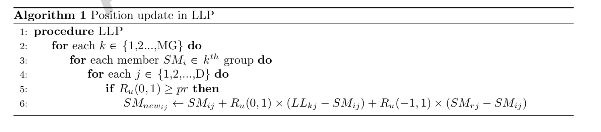
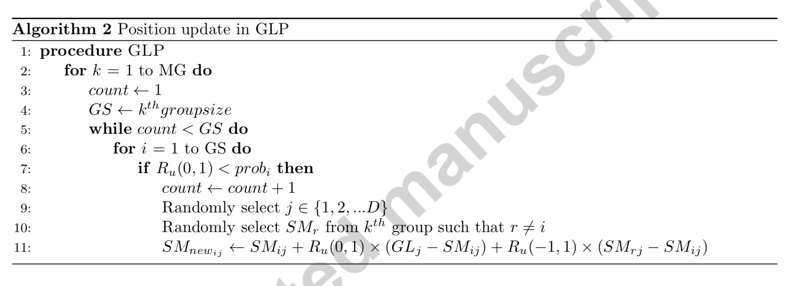
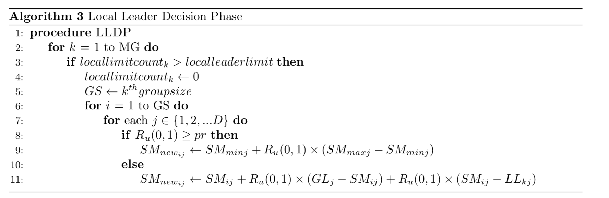
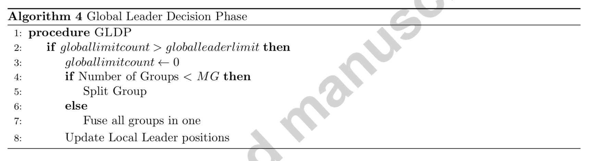

  # Spider Monkey Optimization

A new swarm intelligence algorithm is proposed in terms of fission fusion social structure (FFSS) as these monkeys fall in the category of FFSS based animals. This form of social organization occurs in several species of primates (e.g. common chimpanzees and bonobos, hamadryas baboons, geladas, orangutans, spider monkeys, and humans), African elephants, most carnivores and fishes.

### Social Behavior of Spider Monkeys

Spider monkeys follow FFSS in which they form temporary small subgroups, whose members belong to large stable communities. The composition and size of these subgroups changes frequently due to fluid movement between these groups. The members of these subgroups then communicate through barking and other physical activities depending on the availability of food. In this type of society, the parent subgroup can fission into smaller subgroups and can also fuse again into one big group depending on the environmental or social circumstances. These subgroups are lead by a female leader for searching food which split the subgroups when there is scarcity of food. Main group generally has around 50 members initially and subgroups have at least 3 members. They show territorial behavior after splitting into subgroups to ensure no physical contact.

### Spider Monkey Optimization algorithm

SMO algorithm based of FFSS consists of four basic steps:

1. The group starts foraging and evaluation their distance from the food sources which is termed as the fitness of the monkeys.
2. Based on the fitness of individuals, group members update their positions and then again evaluate the fitness.
3. Local leader (LL) updates its position, i.e. the best position in the group and if the position remains unchanged for a predefined number of times then the group is scattered depending on the perturbation rate (pr).
4. Global leader (GL) updates its position, i.e. the best position among all the monkeys and in case of stagnation; the groups are split in subgroups. If the total number of groups present exceeds the maximum group limit (MG) then all the subgroups are fused into the parent group.

The above steps are continuously executed until the termination criterion is met. Two necessary control parameters in this proposed strategy are localleaderlimit and globalleaderlimit which are used to avoid stagnation in local and global position updates respectively. If LL does not update its position in specified number of times then the group is redirected to a different direction for foraging. If GL fails to update its position after specified number of times then the group is split for independent foraging.

#### Major steps of SMO algorithm

SMO, like other population based algorithms, is also a trial and error based collaborative iterative process where the algorithm tries to reach to the optimum value in minimum number of iterations. The SMO algorithm is divided into six major phases or steps described as follows:

1. **Population Initialization**

   A randomly distributed population **P** of spider monkeys is initialized. Each monkey is a **D** dimensional vector **SMi** *(i = (1, 2, .., P )*, where **D** represents number of variables in the optimization problem and **SMi** refers to the ith spider monkey in the population. Each **SMi** is initialized as:

   

   **SMij =SMminj+Ru(0,1)×(SMmaxj − SMminj)**

   

   where, SMminj and SMmaxj are lower and upper bounds of SMi in jth (j = {1, 2, .., D}) dimension respectively and Ru(0,1) is a uniformly distributed random number in range [0,1].

2. **Local Leader Phase (LLP)**

   In this phase, spider monkeys update their position based on the experience of LL as well as other members of the group. The fitness value of the newly obtained position is calculated and if the fitness value of the new position is more optimum than the old position, then the SM is updated with new position. For ith SM of kth subgroup:

   **SMnewij =SMij +Ru(0,1)×(LLkj −SMij)+Ru(−1,1)×(SMrj −SMij)**

   where, **SMij** is the **ith** **SM** in **jth** dimension, **LLkj** represents the **jth** dimension of the **kth** local group leader position and **SMrj** is the **rth** **SM** chosen randomly from the **kth** group such that **r** not equal to **i**.

   

    

   

3. **Global Leader Phase (GLP)**

   GLP follows LLP where spider monkeys update their position based on experience of GL and members of local group using the equation below.

   **SMnewij =SMij +Ru(0,1)×(GLj −SMij)+Ru(−1,1)×(SMrj −SMij)**

   Where, **GLj** is the global leader’s position in **jth** dimension and j ∈ 1, 2, 3...., D is the randomly chosen index.
    In this phase, the position update of spider monkeys is constrained by a probability value probi which is calculated using their fitness, giving a higher chance to a better candidate to make itself better. Here, *probi* is computed using

   **prob1** = *X* x *fitnessi/max_fitness + y* 

​	where, fitnessi is the fitness of ith monkey. Here, x + y = 1 and optimum results are obtained at values x = 0.9 and y = 0.1.

    

4. **Global Leader Learning Phase (GLL)**

   **GL** updates its position by applying greedy selection process, **SM** having the best fitness among all the monkeys is selected as the new position of **GL**, and if the position of **GL** remains the same, *GlobalLimitCount* is increased by 1.

5. **Local Leader Learning Phase (LLL)**

   The position of **LL** of all the groups are updated by applying greedy selection process and then selecting the monkey **SM** having the best fitness in that group. If the **LL’s** position remains same as before, then the *LocalLimitCount* is increased by 1.

6. **Local Leader Decision Phase (LLD)**

   If a **LL** position is not updated for a predetermined number of iterations i.e. *LocalLeaderLimit*, then the positions of the spider monkeys are updated either by random initialization as in step 1 or by using information from both **LL** and **GL** based on *pr* through following equation.

   SMnewij =SMij +Ru(0,1)×(GLj −SMij)+Ru(0,1)×(SMij −LLkj)

   

    

   

7. **Global Leader Decision Phase (GLD)**

   In this phase, the decision about **GL** position is taken, if the position of **GL** is not updated in predetermined number of iterations i.e. *globalleaderlimit*, then the population is split into subgroups. The groups are split till the number of groups reaches to maximum allowed groups (MG), then they are combined to form a single group again.

    

